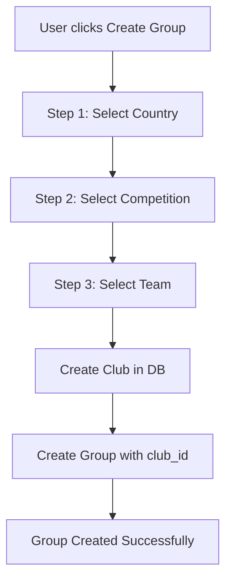

# 🏟️ Club Management System - Complete Guide

## 📚 Documentation Index

All the documentation you need to implement the club management system:

| Document | Purpose |
|----------|---------|
| **[CLUB_IMPLEMENTATION_SUMMARY.md](./CLUB_IMPLEMENTATION_SUMMARY.md)** | ✅ Quick overview of what's done |
| **[CLUB_MANAGEMENT.md](./CLUB_MANAGEMENT.md)** | 📖 Complete API reference |
| **[FRONTEND_INTEGRATION.md](./FRONTEND_INTEGRATION.md)** | 🎨 Step-by-step frontend guide |
| **[EXAMPLE_FRONTEND_COMPONENT.tsx](./EXAMPLE_FRONTEND_COMPONENT.tsx)** | 💻 Ready-to-use React component |
| **[migrations/add_club_to_groups.sql](./migrations/add_club_to_groups.sql)** | 🗄️ Database migration SQL |

---

## 🚀 Quick Start

### 1. Backend is Ready! ✅

All backend implementation is complete:
- ✅ API endpoints for countries, competitions, teams
- ✅ Club creation and management
- ✅ Group-Club association
- ✅ 24-hour caching system
- ✅ Error handling and fallbacks

### 2. Database Migration

The database will auto-migrate on server restart, or run manually:

```bash
docker-compose exec db psql -U postgres -d seatduty -f /migrations/add_club_to_groups.sql
```

### 3. Test the APIs

```bash
# Get countries
curl -X GET "http://localhost:8000/clubs/countries" \
  -H "Authorization: Bearer YOUR_TOKEN"

# Get competitions (replace 6 with country_id)
curl -X GET "http://localhost:8000/clubs/competitions?country_id=6" \
  -H "Authorization: Bearer YOUR_TOKEN"

# Get teams (replace 42 with competition_id)
curl -X GET "http://localhost:8000/clubs/teams?competition_id=42" \
  -H "Authorization: Bearer YOUR_TOKEN"
```

### 4. Implement Frontend

See **[EXAMPLE_FRONTEND_COMPONENT.tsx](./EXAMPLE_FRONTEND_COMPONENT.tsx)** for a complete, copy-paste ready implementation.

---

## 📋 The Flow



### User Journey:

1. **User clicks "Create Group"**
2. **Select Country** → API: `GET /clubs/countries`
3. **Select Competition** → API: `GET /clubs/competitions?country_id={id}`
4. **Select Team** → API: `GET /clubs/teams?competition_id={id}`
5. **Create Club** → API: `POST /clubs/create-from-team?...`
6. **Enter Group Details** (name, description)
7. **Create Group** → API: `POST /groups` (with club_id)

---

## 🎯 API Endpoints Summary

| Endpoint | Method | What it does |
|----------|--------|--------------|
| `/clubs/countries` | GET | Get list of countries with football |
| `/clubs/competitions?country_id={id}` | GET | Get leagues/competitions in a country |
| `/clubs/teams?competition_id={id}` | GET | Get teams in a competition |
| `/clubs/create-from-team?team_id={id}&...` | POST | Register a club from team selection |
| `/groups` | POST | Create group (now accepts `club_id`) |

---

## 💡 Key Features

### 1. Intelligent Caching
- API responses cached for 24 hours
- Reduces load on 365scores API
- Fallback to stale cache if API fails

### 2. Optional Club Association
- Groups can have clubs OR be standalone
- User can skip club selection
- `club_id` field is nullable

### 3. Complete Metadata
- Stores country, competition, team info
- Club logos and images
- Competition details

### 4. Error Resilient
- Graceful handling of API failures
- Returns cached data when available
- Clear error messages

---

## 📁 What Was Created/Modified

### New Files:
```
backend2/
├── app/clubs/                           # NEW MODULE
│   ├── __init__.py
│   └── routers.py
├── migrations/
│   └── add_club_to_groups.sql          # NEW
├── CLUB_README.md                      # NEW (this file)
├── CLUB_IMPLEMENTATION_SUMMARY.md      # NEW
├── CLUB_MANAGEMENT.md                  # NEW
├── FRONTEND_INTEGRATION.md             # NEW
└── EXAMPLE_FRONTEND_COMPONENT.tsx      # NEW
```

### Modified Files:
```
backend2/
├── app/groups/
│   ├── models.py         # Added club_id to Group, updated Club
│   ├── schemas.py        # Added club_id, new schemas
│   └── routers.py        # Updated create_group
├── server.py             # Registered clubs router
└── .gitignore           # Added cache/
```

---

## 🧪 Testing Checklist

- [ ] Test countries endpoint
- [ ] Test competitions endpoint
- [ ] Test teams endpoint
- [ ] Test club creation
- [ ] Test group creation with club
- [ ] Test group creation without club
- [ ] Verify caching works
- [ ] Verify cache expiration
- [ ] Test error handling (disconnect API)

---

## 🎨 Frontend TODO

1. [ ] Create ClubSelectionWizard component
2. [ ] Add TypeScript types for Club, Country, Competition, Team
3. [ ] Integrate wizard into group creation flow
4. [ ] Add club display in group cards/details
5. [ ] Test end-to-end flow
6. [ ] Add loading states
7. [ ] Add error handling
8. [ ] Style the components

**Estimated Time:** 2-4 hours with the provided example component

---

## 🔗 External API

**Data Source:** 365scores.com API

**Endpoints Used:**
1. `https://webws.365scores.com/web/countries/...` - Countries
2. `https://webws.365scores.com/web/competitions/...` - Competitions
3. `https://webws.365scores.com/web/standings/...` - Teams (from standings)

**Rate Limiting:** Handled by 24-hour cache

---

## ❓ FAQ

**Q: Do I need to implement caching on the frontend?**  
A: No! The backend handles all caching.

**Q: What if the 365scores API changes?**  
A: The backend will return cached data. You may need to update the endpoints in `app/clubs/routers.py`.

**Q: Can users change the club after group creation?**  
A: Not currently implemented. You can add an update endpoint if needed.

**Q: How do I force refresh the cache?**  
A: Add `?force_refresh=true` to any GET request.

**Q: Can I use a different sports data API?**  
A: Yes! Just update the URLs in `app/clubs/routers.py`.

---

## 🎉 You're All Set!

The backend is **100% complete**. Just implement the frontend using the example component, and you'll have a fully functional club management system!

### Next Steps:
1. ✅ Read [FRONTEND_INTEGRATION.md](./FRONTEND_INTEGRATION.md)
2. ✅ Copy [EXAMPLE_FRONTEND_COMPONENT.tsx](./EXAMPLE_FRONTEND_COMPONENT.tsx)
3. ✅ Adapt to your UI framework
4. ✅ Test and deploy!

---

**Happy Coding! 🚀**

